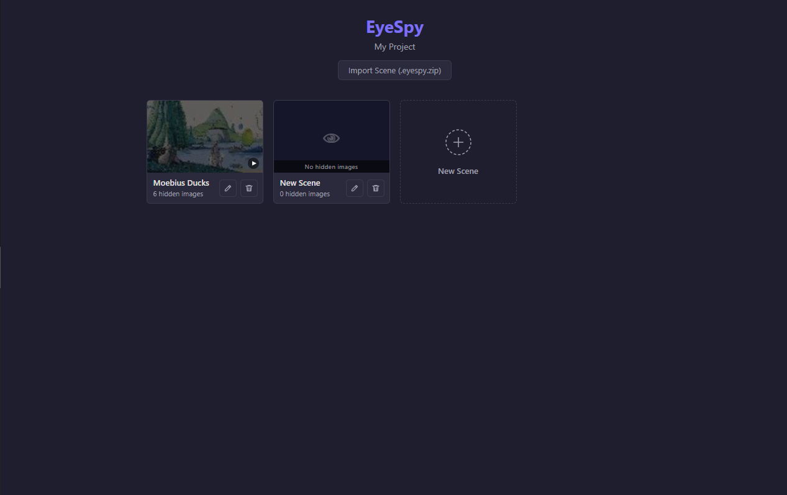
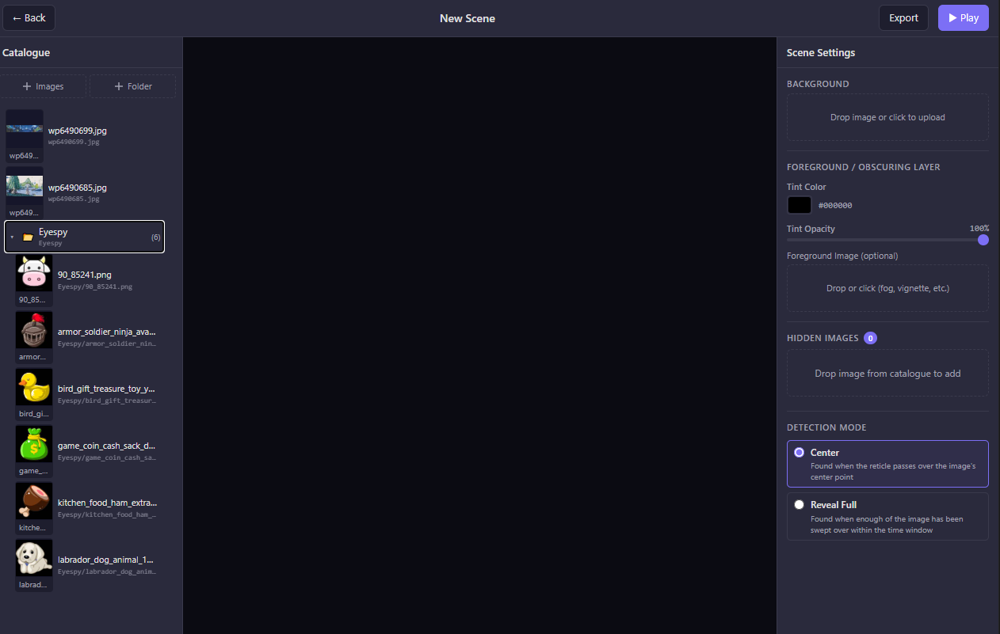
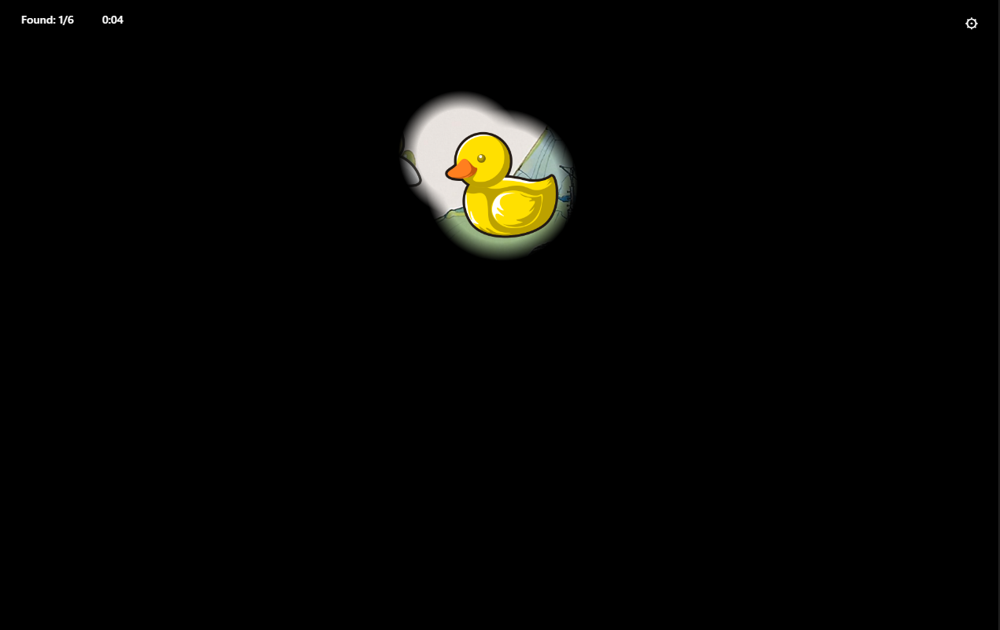

# EyeSpy

A browser-based hidden-image puzzle game with a built-in scene editor. Move a spotlight across a darkened image to reveal hidden objects — find them all to complete the level.

**[Play on itch.io →](https://oakfather.itch.io/eyespy)**

---

## Scene Select



Your scenes are listed here. Click a card to play, or use the edit and delete buttons to manage them. Import scenes shared by others as `.eyespy.zip` files, or create a new one from scratch.

---

## Scene Editor



Build a puzzle scene in three panels:
- **Left** — Upload images to your catalogue, organized in folders
- **Center** — Live preview of the scene
- **Right** — Set a background, configure the obscuring layer, add hidden images, and choose a detection mode

Export any scene as a self-contained `.eyespy.zip` to share with others.

---

## Play Mode



Move your mouse (or finger on mobile) to sweep the spotlight across the scene. Hidden images are revealed as you explore. Find all of them to complete the level.

Use the ⚙ menu to adjust spotlight size, restart, or return to the editor.

---

## Run Locally

```bash
npm install
npm run dev
```

## Test

```bash
npm test          # unit tests
npm run test:e2e  # integration tests (requires dev server)
```
